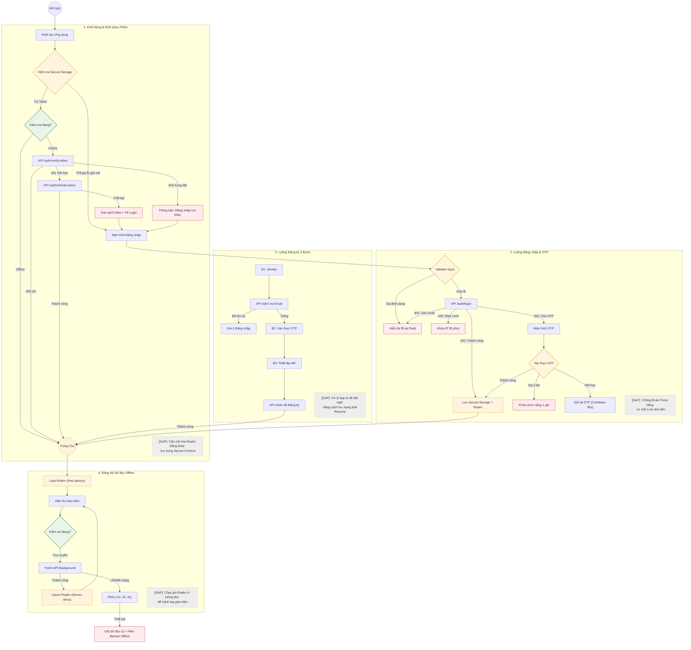

# Đặc tả Kiến trúc Xác thực & Dữ liệu (Chi tiết Từng Node)

Tài liệu này cung cấp đặc tả chi tiết cho từng bước (node/ô) trong hệ thống xác thực và đồng bộ dữ liệu, phân tích sâu các trường hợp sử dụng (cases) và lỗ hổng (gaps) cho mỗi bước.

---

## 1. Sơ đồ Luồng Siêu Chi tiết (Tích hợp Cases & Gaps)

---

## 2. Đặc tả Chi tiết từng Node (Ô) trong Sơ đồ

Dưới đây là phân tích chi tiết cho từng ô (step) xuất hiện trong sơ đồ luồng phía trên.

### 2.1. Phân đoạn: Khởi động (Launch Logic)

#### Ô: Start (Mở App)
- **Cases**: Khởi tạo Splash Screen, kiểm tra các dịch vụ nền.
- **Gaps**: Lỗi crash sớm nếu các thư viện bên thứ 3 khởi tạo không thành công.

#### Ô: Init (Khởi tạo Ứng dụng)
- **Cases**: Cấu hình Realm, Logger, API Client.
- **Gaps**: Realm Migration có thể gây treo App nếu schema thay đổi quá lớn mà không xử lý tốt.

#### Ô: CheckStorage (Kiểm tra Secure Storage)
- **Cases**:
    - *Thành công*: Đọc được `accessToken`.
    - *Lỗi giải mã*: Xảy ra khi restore app từ cloud sang thiết bị khác -> **Bắt buộc xóa sạch token và yêu cầu login lại**.
- **Gaps**: Keychain (iOS) thỉnh thoảng trả về lỗi "Item not found" ngay cả khi nó tồn tại nếu máy chưa unlock.

#### Ô: NetCheck1 (Kiểm tra Mạng?)
- **Cases**: Phân biệt giữa "No Connection" và "Captive Portal" (wifi cần login).
- **Gaps**: Wifi yếu có thể làm NetCheck trả về "Trực tuyến" nhưng request sau đó vẫn timeout.

#### Ô: VerifyAPI (API /auth/verify-token)
- **Cases**:
    - *200*: Token ổn.
    - *401*: Cần Refresh.
    - *403*: Phiên bị ghi đè (Single Session).
- **Gaps**: Token có thể hết hạn ngay sau khi verify thành công (cần interceptor 401).

#### Ô: RefreshToken (API /auth/refresh-token)
- **Cases**: Xử lý logic lưu token mới và thử lại request cũ.
- **Gaps**: Nếu Refresh Token cũng hết hạn -> Trải nghiệm người dùng bị đứt gãy, cần thông báo khéo léo.

#### Ô: ConflictMsg (Thông báo Đăng nhập nơi khác)
- **Cases**: Popup "Tài khoản của bạn đang được đăng nhập trên thiết bị khác".
- **Gaps**: Cần đảm bảo xóa sạch dữ liệu nhạy cảm trong Realm ngay khi nhận code 403.

---

### 2.2. Phân đoạn: Đăng nhập & OTP (Login Flow)

#### Ô: InputValidate (Validate Input)
- **Cases**: Email format, độ dài mật khẩu.
- **Gaps**: Cần chuẩn hóa email (lowercase, trim) trước khi gửi lên API.

#### Ô: APILogin (API /auth/login)
- **Cases**: Thành công, Sai pass, Cần OTP, Tài khoản bị khóa.
- **Gaps**: Backend cần che giấu lý do thất bại (Email sai hay Pass sai) để tránh Enumeration Attack.

#### Ô: LockIP (Khóa IP 30 phút)
- **Cases**: Chặn dải IP có dấu hiệu brute-force.
- **Gaps**: Người dùng dùng chung Wifi (Public Wifi) có thể bị khóa oan.

#### Ô: OTPScreen & OTPAction
- **Cases**: Nhập sai, Hết hạn, Gửi lại.
- **Gaps**: Cần cơ chế tự động focus vào ô OTP tiếp theo khi người dùng nhập.

#### Ô: LockOTP (Khóa chức năng 1 giờ)
- **Cases**: Khóa theo tài khoản sau 3 lần sai OTP.
- **Gaps**: Người dùng cần biết chính xác khi nào họ có thể thử lại (đếm ngược).

---

### 2.3. Phân đoạn: Đồng bộ Dữ liệu (Sync Flow)

#### Ô: LoadRealm (Tải từ Realm)
- **Cases**: Query dữ liệu hiển thị tức thì.
- **Gaps**: Realm Object bị "stale" nếu không được quản lý tốt vòng đời.

#### Ô: FetchServer (API Background)
- **Cases**: Tải dữ liệu trang chủ ngầm.
- **Gaps**: Tiêu tốn băng thông nếu sync quá nhiều dữ liệu không cần thiết.

#### Ô: UpdateRealm (Upsert Realm)
- **Cases**: Ghi đè dữ liệu mới nhất.
- **Gaps**: **Lag giao diện** (Jank) nếu ghi hàng nghìn bản ghi trên Main Thread.

#### Ô: RetryLogic (Thử lại)
- **Cases**: Tự động thử lại khi mạng phục hồi.
- **Gaps**: Gây spam server nếu server đang bị quá tải (cần Circuit Breaker).

---

## 3. Bảng Tổng kết Rủi ro (Gaps) & Giải pháp

| Bước (Node) | Rủi ro (Gap) | Giải pháp Kiến nghị |
| :--- | :--- | :--- |
| **CheckStorage** | Dữ liệu bị hỏng sau khi update OS | Bắt ngoại lệ `corrupted storage`, xóa sạch và reset state. |
| **VerifyAPI** | Mạng "ảo" (Wifi không internet) | Thêm bước ping một domain tin cậy (Google/Cloudflare). |
| **RefreshToken** | Race Condition (nhiều req cùng gọi) | Sử dụng `Atomic Lock` hoặc `Queue` cho việc Refresh Token. |
| **APILogin** | Dò quét tài khoản (Account Enumeration) | Thông báo lỗi chung chung: "Thông tin không chính xác". |
| **UpdateRealm** | Lag UI khi đồng bộ dữ liệu lớn | Sử dụng `realm.writeAsync` hoặc chạy trong luồng Worker. |
| **RetryLogic** | Spam request khi server lỗi | Giới hạn số lần thử và tăng độ trễ (Exponential Backoff). |
| **OfflineMode** | Người dùng thực hiện thao tác ghi | Thêm `SyncQueue` để lưu lại các lệnh "Ghi" khi offline. |
| **ConflictMsg** | Rò rỉ phiên cũ | Xóa `accessToken` ngay lập tức khi nhận code 403 từ server. |
